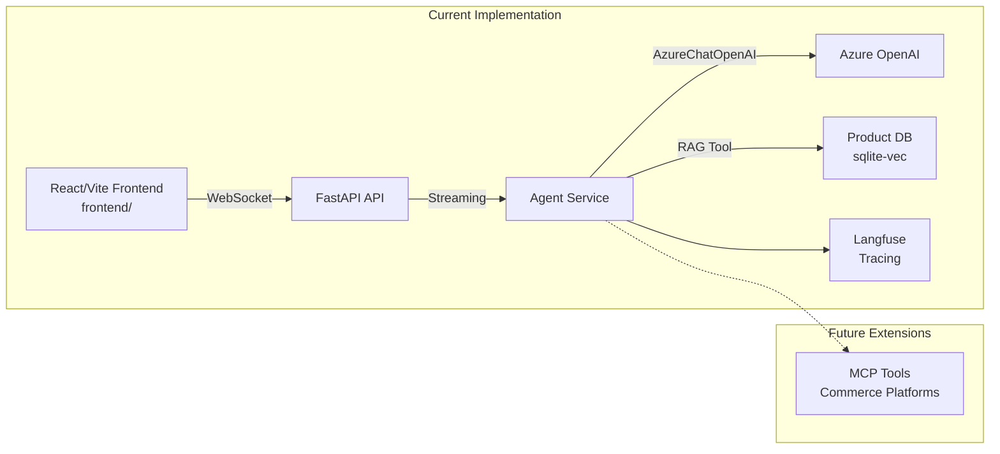

<div align="center">
  <h1>chatguru AI Agent</h1>
</div>

<div align="center">
  
  
  
  
</div>

<div align="center">
  <a href="#Docs">Documentation</a> &nbsp;|&nbsp; <a href="#Preview">Preview</a> &nbsp;|&nbsp; <a href="#Installation">Installation</a> &nbsp;|&nbsp; <a href="#Contributing">Contributing</a>
</div>

<br/>

<p align="center">
  chatguru Agent is a production-ready whitelabel chatbot with RAG capabilities and agentic commerce integration, built with FastAPI, LangChain, and Azure OpenAI.
</p>

<div align="center">
  <br/><em>Brought with</em> &nbsp;❤️ <em>by</em> &nbsp; <a href="https://www.netguru.com">Netguru</a>
</div>


## Documentation <a name="Docs"></a>

Read the full Docs at: <a href="https://github.com/netguru/chatguru">https://github.com/netguru/chatguru</a>

## Preview <a name="Preview"></a>

chatguru Agent ships with WebSocket streaming, RAG capabilities, and comprehensive observability!

**Key Features:**
- Real-time WebSocket streaming for instant responses
- RAG-powered product search and recommendations
- Comprehensive API documentation with Swagger UI

## Installation <a name="Installation"></a>

### Installation & requirements

#### Install latest library version

:information_source: Library supports Python 3.12+

#### Install library's dependencies

```bash
# Clone the repository
git clone <repository-url>
cd chatguru

# Complete development setup
make setup
```

After installation:

```bash
# Configure environment variables
make env-setup
# Edit .env with your credentials

# Start the development server
make dev
```

## In Use

**Check the live demo at http://localhost:8000/**

This is how you can use the WebSocket API in your app:

```python
import asyncio
import websockets
import json

async def chat():
    uri = "ws://localhost:8000/ws"
    async with websockets.connect(uri) as websocket:
        # Send message
        await websocket.send(json.dumps({
            "message": "Hello, how are you?",
            "session_id": None
        }))

        # Receive streaming response
        async for message in websocket:
            data = json.loads(message)
            if data["type"] == "token":
                print(data["content"], end="", flush=True)
            elif data["type"] == "end":
                print("\n")
                break
            elif data["type"] == "error":
                print(f"Error: {data['content']}")
                break

asyncio.run(chat())
```

## ✨ Features

- **🚀 WebSocket Streaming**: Real-time streaming chat responses via WebSocket
- **🧪 Minimal Test UI**: Lightweight HTML at `/` for smoke testing only
- **🎨 Whitelabel Design**: Easily customizable for different brands and tenants
- **🧠 RAG Capabilities**: Semantic product search with sqlite-vec vector database
- **🛒 Agentic Commerce**: Ready for MCP (Model Context Protocol) integration
- **📊 Observability**: Built-in Langfuse tracing and monitoring
- **✅ Testing**: Comprehensive test suite with promptfoo LLM evaluation
- **🐳 Production Ready**: Docker containerization with health checks

## 🏗️ Architecture

Simple, modular architecture designed for whitelabel deployment:



For detailed architecture documentation, see [docs/architecture.md](docs/architecture.md).

## 🛠️ Technology Stack

- **Backend**: FastAPI + Uvicorn (async)
- **AI/ML**: LangChain + Azure OpenAI (direct integration)
- **LLM Provider**: Azure OpenAI (via langchain-openai)
- **Vector Search**: sqlite-vec (semantic product search)
- **Observability**: Langfuse
- **Testing**: pytest + promptfoo + GenericFakeChatModel
- **Code Quality**: mypy + ruff + pre-commit
- **Frontend**: React 19 + Vite (`frontend/`)
- **CSS**: Tailwind CSS v4 (via `@tailwindcss/vite`)
- **Containerization**: Docker + Docker Compose
- **Package Management**: uv (Python) + npm (Node.js)
- **Development**: Makefile for task automation

## 🌐 Frontend

A React + Vite frontend lives in the `frontend/` directory.

Run it locally:

```bash
make frontend-dev   # Vite dev server → http://localhost:5173
```

Or via Docker Compose — the `frontend` service starts automatically on port 5173.

Copy the env template before running:

```bash
cp frontend/.env.example frontend/.env
```

## 📋 Prerequisites

Before you begin, ensure you have the following installed:

- **Python 3.12+** ([Download](https://www.python.org/downloads/))
- **Node.js 20+** and npm — required by React 19 ([Download](https://nodejs.org/))
- **uv** - Fast Python package installer ([Installation guide](https://github.com/astral-sh/uv))
- **Docker** and Docker Compose (optional, for containerized deployment)
- **Azure OpenAI account** with API access
- **Langfuse account** (for observability and tracing)

## 🚀 Quick Start

### Option 1: Local Development (Recommended for Development)

#### 1. Clone the Repository

```bash
git clone <repository-url>
cd chatguru
```

#### 2. Complete Development Setup

```bash
# Install dependencies and set up pre-commit hooks
make setup
```

This command will:
- Install Python dependencies using `uv`
- Install and configure pre-commit hooks
- Set up the development environment

#### 3. Configure Environment Variables

```bash
# Copy environment template
make env-setup

# Edit .env with your credentials
# Required: LLM_* and LANGFUSE_* variables (see Configuration section below)
```

#### 4. Start the Development Server

```bash
make dev
```

#### 5. Access the Application

- **Frontend**: http://localhost:5173
- **Test UI (Minimal)**: http://localhost:8000/  _(for smoke testing only)_
- **Backend API**: http://localhost:8000
- **API Documentation**: http://localhost:8000/docs
- **WebSocket Endpoint**: ws://localhost:8000/ws

### Option 2: Docker Deployment (Recommended for Production)

#### 1. Clone and Configure

```bash
git clone <repository-url>
cd chatguru

# Copy and configure environment variables
make env-setup
# Edit .env with your credentials
```

#### 2. Build and Run

```bash
# Build and start all services
make docker-run

# Or run in background
make docker-run-detached
```

#### 3. Access the Application

- **Frontend**: http://localhost:5173
- **Test UI (Minimal)**: http://localhost:8000/  _(for smoke testing only)_
- **Backend API**: http://localhost:8000
- **API Documentation**: http://localhost:8000/docs
- **WebSocket Endpoint**: ws://localhost:8000/ws

## 🔧 Configuration

The application uses environment variables for configuration. Copy `env.example` to `.env` and configure the following:

### Required Environment Variables

| Variable | Description | Example |
|----------|-------------|---------|
| `LLM_ENDPOINT` | Azure OpenAI endpoint URL | `https://your-resource.openai.azure.com/` |
| `LLM_API_KEY` | Azure OpenAI API key | `your-api-key-here` |
| `LLM_DEPLOYMENT_NAME` | Azure OpenAI deployment name | `gpt-4o-mini` |
| `LLM_API_VERSION` | Azure OpenAI API version | `2024-02-15-preview` |
| `LANGFUSE_PUBLIC_KEY` | Langfuse public key | `pk-lf-...` |
| `LANGFUSE_SECRET_KEY` | Langfuse secret key | `sk-lf-...` |
| `LANGFUSE_HOST` | Langfuse host URL | `https://cloud.langfuse.com` |

### Optional Environment Variables

| Variable | Description | Default |
|----------|-------------|---------|
| `FASTAPI_HOST` | API host address | `0.0.0.0` |
| `FASTAPI_PORT` | API port | `8000` |
| `FASTAPI_CORS_ORIGINS` | CORS allowed origins (JSON array) | `["*"]` |
| `APP_NAME` | Application name | `chatguru Agent` |
| `DEBUG` | Enable debug mode | `false` |
| `LOG_LEVEL` | Logging level | `INFO` |
| `VECTOR_DB_TYPE` | Database type | `sqlite` |
| `VECTOR_DB_SQLITE_URL` | SQLite service URL | `http://product-db:8001` |

See [env.example](env.example) for a complete template with detailed comments.

## 📡 API Documentation

### WebSocket API

The primary interface for chat is via WebSocket at `ws://localhost:8000/ws`.

#### Request Format

```json
{
  "message": "Your message here",
  "session_id": "optional-session-id",
  "messages": [
    {"role": "user", "content": "previous user message"},
    {"role": "assistant", "content": "previous assistant response"}
  ]
}
```

#### Response Format

Responses are streamed as JSON messages:

```json
// Token chunk (streamed multiple times)
{"type": "token", "content": "chunk of text", "session_id": "session-id"}

// End of stream (includes the full response as safety)
{"type": "end", "content": "full assistant response", "session_id": "session-id"}

// Error response
{"type": "error", "content": "error message", "session_id": "session-id"}
```

### REST API

- **Health Check**: `GET /health`
- **API Documentation**: `GET /docs` (Swagger UI)
- **OpenAPI Schema**: `GET /openapi.json`

## 🛠️ Development

### Available Commands

Run `make help` to see all available commands. Key commands:

#### Installation & Setup
```bash
make setup          # Complete development setup
make env-setup      # Copy environment template
make install        # Install production dependencies
```

#### Development Servers
```bash
make dev            # Start backend development server (auto-reload)
make frontend-dev   # Start frontend development server (Vite, port 5173)
make run            # Start production server (no auto-reload)
```

#### Testing
```bash
make test           # Run all tests
make coverage       # Run tests with coverage report
make promptfoo-eval # Run LLM evaluation tests
make promptfoo-view # View evaluation results
```

#### Code Quality
```bash
make pre-commit-install  # Install pre-commit hooks
make pre-commit          # Run pre-commit checks manually
```

#### Docker
```bash
make docker-build        # Build Docker images
make docker-run          # Run with Docker Compose (foreground)
make docker-run-detached # Run with Docker Compose (background)
make docker-stop         # Stop services
make docker-down         # Stop and remove containers
make docker-logs         # View logs
make docker-clean        # Clean all Docker resources
```

#### Utilities
```bash
make version        # Show current version
make clean          # Clean Python cache files
```

### Project Structure

```
chatguru/
├── frontend/                # React + Vite frontend
│   ├── src/                 # Source code (components, hooks, pages)
│   ├── public/              # Static assets
│   ├── .env.example         # Frontend env template
│   └── package.json
├── src/                     # Main application code
│   ├── api/                 # FastAPI application
│   │   ├── main.py         # FastAPI app setup
│   │   ├── templates/      # Minimal HTML test UI
│   │   └── routes/         # API routes
│   │       └── chat.py     # WebSocket chat endpoint
│   ├── agent/              # Agent implementation
│   │   ├── service.py      # LangChain agent with streaming
│   │   ├── prompt.py       # System prompts
│   │   └── __init__.py
│   ├── product_db/          # Product database (sqlite-vec)
│   │   ├── api.py          # FastAPI service
│   │   ├── store.py        # ProductStore with embeddings
│   │   ├── sqlite.py       # HTTP client for agent
│   │   ├── base.py         # Abstract interface
│   │   └── factory.py      # Database factory
│   ├── rag/                # RAG components
│   │   ├── documents.py    # Document handling
│   │   ├── simple_retriever.py  # Retriever interface
│   │   └── products.json   # Sample products data
│   ├── config.py           # Configuration management
│   └── main.py             # Application entry point
├── tests/                  # Test suite
│   ├── test_api.py         # API endpoint tests
│   ├── test_agent.py       # Agent tests
│   └── conftest.py         # Test configuration
├── docs/                   # Documentation
│   └── architecture.md      # Architecture documentation
├── promptfoo/              # LLM evaluation config
│   ├── provider.py         # Python provider adapter
│   └── promptfooconfig.yaml
├── docker/                 # Docker configuration
│   ├── Dockerfile          # Backend Dockerfile
│   └── Dockerfile.db       # Product database Dockerfile
├── .pre-commit-config.yaml # Pre-commit hooks
├── docker-compose.yml      # Docker Compose setup
├── Makefile                # Development commands
├── pyproject.toml          # Python project configuration
├── env.example             # Environment template
└── README.md               # This file
```

## 🧪 Testing

### Unit Tests

```bash
# Run all tests
make test

# Run with coverage report
make coverage
```

Tests use `GenericFakeChatModel` from LangChain for reliable, deterministic testing without API calls.

### LLM Evaluation with Promptfoo

```bash
# Run evaluation suite
make promptfoo-eval

# View results in browser
make promptfoo-view

# Run specific test file
make promptfoo-test TEST=tests/basic_greeting.yaml
```

Promptfoo tests evaluate response quality, helpfulness, and boundary conditions.

### RAG Evaluation with RAGAS and RAG Evaluator

RAGAS (Retrieval-Augmented Generation Assessment) and RAG Evaluator are frameworks/tools for evaluating the performance of Retrieval-Augmented Generation (RAG) systems. They provide metrics to assess aspects like faithfulness, answer relevance, context precision, and retrieval quality in RAG pipelines.

For detailed information on RAG testing and evaluation using RAGAS and RAG Evaluator, see [docs/rag_eval_readme.md](docs/rag_eval_readme.md).

## 🐳 Docker Deployment

### Quick Start

```bash
# Build and run backend with Docker Compose
make docker-run
```

### Manual Docker Commands

```bash
# Build backend image
docker build -f docker/Dockerfile -t chatguru-agent .

# Run backend container
docker run -p 8000:8000 --env-file .env chatguru-agent
```

### Ports

- **Frontend**: `5173` (host) → `5173` (container)
- **Backend API**: `8000` (host) → `8000` (container)
- **Product DB**: `8001` (host) → `8001` (container)
- **WebSocket**: `ws://localhost:8000/ws`
- **Test UI**: `http://localhost:8000/` (minimal, not production)

### Frontend Service

The `frontend` service is included in Docker Compose and starts automatically on port 5173.
`WS_PROXY_TARGET` controls where Vite proxies WebSocket traffic inside the Docker network
(default: `http://chatguru-agent:8000`).

## 🐛 Troubleshooting

### Common Issues

#### 1. "Module not found" errors

**Solution**: Ensure dependencies are installed:
```bash
make install
```

#### 2. WebSocket connection fails

**Solution**:
- Verify backend is running: `curl http://localhost:8000/health`
- Check WebSocket endpoint: `ws://localhost:8000/ws`
- Ensure CORS is configured correctly in `.env`

#### 3. Azure OpenAI authentication errors

**Solution**:
- Verify `LLM_ENDPOINT` includes trailing slash
- Check `LLM_API_KEY` is correct
- Ensure `LLM_DEPLOYMENT_NAME` matches your Azure deployment
- Verify `LLM_API_VERSION` is supported

#### 4. Langfuse connection errors

**Solution**:
- Verify Langfuse credentials in `.env`
- Check `LANGFUSE_HOST` is correct (default: `https://cloud.langfuse.com`)
- Ensure network connectivity to Langfuse

#### 5. Docker build fails

**Solution**:
- Ensure `uv.lock` file exists (run `uv sync` locally first)
- Check Docker has sufficient resources
- Verify all required files are present

#### 6. Port already in use

**Solution**:
- Backend (8000): Stop other services using port 8000 or change `FASTAPI_PORT`
- Frontend: Configure your external frontend to target the correct backend host/port

### Getting Help

- Check [docs/architecture.md](docs/architecture.md) for architecture details
- Review [CONTRIBUTING.md](CONTRIBUTING.md) for development guidelines
- Open an issue on GitHub for bugs or feature requests

## 📚 Documentation

- [Architecture Guide](docs/architecture.md) - Detailed architecture documentation
- [Contributing Guide](CONTRIBUTING.md) - How to contribute to the project
- [Getting Started Guide](GETTING_STARTED.md) - Detailed setup instructions

## 🤝 Contributing <a name="Contributing"></a>

We welcome contributions! Please see [CONTRIBUTING.md](CONTRIBUTING.md) for:

- Development setup instructions
- Code style guidelines
- Testing requirements
- Pull request process
- Issue reporting guidelines

## 🔮 Roadmap

- [x] **Vector Database Integration**: sqlite-vec for semantic search ✅
- [x] **Streaming Responses**: Real-time chat streaming via WebSocket ✅
- [ ] **MCP Tools**: Integration with commerce platforms (PimCore, Strapi, Medusa.js)
- [ ] **Authentication**: JWT-based API authentication
- [ ] **Rate Limiting**: API rate limiting and quotas
- [x] **Session Management**: Client-side persistent conversation history (localStorage) ✅
- [ ] **Server-side Sessions**: Backend-persisted conversation history
- [ ] **Multi-tenancy**: Database-backed tenant configuration

## 📄 License

This library is available as open source under the terms of the [MIT License](https://opensource.org/licenses/MIT).

## 🙏 Acknowledgments

- [FastAPI](https://fastapi.tiangolo.com/) - Modern web framework
- [LangChain](https://www.langchain.com/) - LLM application framework
- [Langfuse](https://langfuse.com/) - LLM observability platform
- [promptfoo](https://www.promptfoo.dev/) - LLM evaluation framework

## 🆘 Support

For support and questions:

- 📖 Check the [documentation](docs/)
- 🐛 [Open an issue](https://github.com/netguru/chatguru/issues) for bugs
- 💬 [Start a discussion](https://github.com/netguru/chatguru/discussions) for questions
- 📧 Contact the maintainers

---
