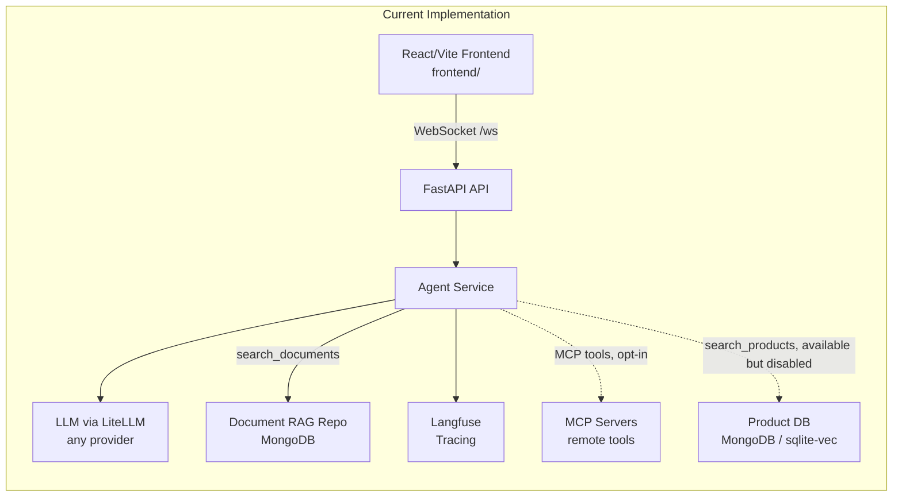

# chatguru Agent Architecture

## Overview

chatguru Agent is a whitelabel chatbot designed for agentic commerce with RAG capabilities. The React/Vite frontend lives in the `frontend/` directory and communicates with the backend via WebSocket. The architecture is built for maintainability, scalability, and easy customization across different brands and tenants.

## System Architecture

Simple, modular architecture designed for whitelabel deployment:



### Architecture Vision

The system is designed to evolve from a simple chat interface to a full agentic commerce platform:

**Phase 1**: Basic chat with an LLM (provider-agnostic via LiteLLM) ✅
**Phase 2 (Current)**: RAG with a pluggable vector database — MongoDB (Atlas Local) by default, sqlite-vec via `--profile sqlite` ✅
**Phase 3**: MCP tool integration ✅ (opt-in); commerce-platform connectors (PimCore, Strapi, Medusa.js, Stripe) still planned
**Phase 4**: Full agentic commerce with payment processing and order management

## Component Details

### 1. API Layer (FastAPI)

**Purpose**: HTTP API interface and request handling

**Components**:
- **FastAPI Application**: Main web framework
- **CORS Middleware**: Cross-origin resource sharing
- **Health Checks**: Service health monitoring
- **Request/Response Models**: Pydantic validation
- **WebSocket Gateway**: Streaming endpoint at `/ws` (expects a `messages` transcript whose last entry is the current user turn; optional `session_id`, `visitor_id`, `model`, and `auth_token` — there is no top-level `message` field)

**Key Features**:
- Async request handling
- Automatic API documentation (Swagger/OpenAPI)
- Request validation and error handling
- CORS configuration for web clients

### 2. Agent Layer (LangChain + LiteLLM agentic loop)

**Purpose**: Core AI agent logic and conversation management

**Current Implementation**:
- **Agent Service**: LangChain + LiteLLM (`ChatLiteLLM`) driving an async, streaming tool-calling loop
- **Agentic Loop**: `astream()` streams tokens, detects tool calls, executes them, appends results, and re-prompts until the model returns a final answer or `MAX_TOOL_ITERATIONS` (10) is reached
- **Tools**: Built-in `search_products` and `search_documents`, plus optional remote MCP tools discovered live for each turn
- **System Prompt**: Fetched from Langfuse (`CHAT_SYSTEM_PROMPT`) on every turn so edits apply without a redeploy; falls back to the local `agent/prompt.py` prompt when Langfuse is unavailable
- **Multimodal**: Image attachments on the current user turn are passed to the LLM as `image_url` content blocks

**Architecture**:
- **Provider-agnostic**: LiteLLM routes by model id (`openai/…`, `azure/…`, `anthropic/…`, `ollama/…`)
- **Per-request model override**: A request may select any model listed in the models config; otherwise the default model is used
- **Testing**: Uses GenericFakeChatModel for reliable testing

**Workflow**:
1. **Receive Transcript**: Accept the full conversation over the WebSocket
2. **Build Messages**: Prepend the (Langfuse-managed) system prompt to the transcript
3. **Stream & Iterate**: Stream tokens; when the model emits tool calls, execute them, append results, and continue the loop
4. **Finish**: Stop when the model returns a final answer (or the iteration cap is hit) and send the terminating frame

### 3. Product Database (vector search — MongoDB / sqlite-vec)

**Purpose**: Semantic product search with vector embeddings

**Status**: Present in the repo but not wired into the default chat runtime. The WebSocket handler constructs the Agent with `vector_database=None` (`src/api/routes/chat.py`), so the constructor's `else` branch (`src/agent/service.py`) registers no tool — only `search_documents` is bound. The built-in fallback system prompt (`agent/prompt.py`, StyleBot) still references `search_products`; the active prompt is fetched at runtime from Langfuse (`CHAT_SYSTEM_PROMPT`) and is not stored in this repo. The service and code below remain in place and can be re-enabled by passing a `VectorDatabase` instance to the Agent.

**Architecture**:
- **Separate Container**: Runs as `vector-db` service on port 8001 (Docker Compose sqlite profile)
- **sqlite-vec**: SQLite extension for vector similarity search
- **Embeddings**: OpenAI-compatible endpoint; dimensions configurable (default 1536, e.g. text-embedding-ada-002)

**Components**:
- `VectorStore` / `vector_db/store.py`: Core SQLite + sqlite-vec logic and **inline DDL** for `products` and embedding tables
- `SQLiteVectorDatabase`: HTTP client for the agent to call the service
- Pluggable backends (e.g. MongoDB) via `VECTOR_DB_TYPE`

**Database schema (RAG):** Defined in application code (`vector_db/store.py`), not in Alembic. Chat history schema is separate (Alembic + `persistence/sqlalchemy/tables.py`). Whether those use the same physical SQLite file is a deployment choice; **where DDL lives in the repo** is documented in [design-decisions.md](design-decisions.md#database-schema-ownership).

**Data Flow**:
```
Agent → HTTP GET /search?q=... → product-db container → sqlite-vec → Results
```

### 4. Document RAG Repository

**Purpose**: Grounded document context for the `search_documents` tool — retrieval with numbered citations, plus source-document serving and an ingestion pipeline.

**Architecture**:
- Port + adapter + factory + lifecycle bootstrap (mirrors persistence architecture)
- Typed retrieval models (`DocumentRetrievalHit`, `DocumentSourceReference`)
- MongoDB vector search adapter (default), with a Cosmos DB adapter alongside
- Retrieval returns snippets tagged with stable citation numbers; the WebSocket `end` frame carries the structured sources
- Source documents live in MongoDB GridFS and are served over `GET /documents/{path}`
- Ingestion subsystem (`document_rag/ingestion/`, CLI-driven) runs at startup from `/app/rag_data`, guarded by a sentinel so it ingests once (see `docker/entrypoint.sh`)

**Lifecycle policy**:
- Disabled by default (`DOCUMENT_RAG_ENABLED=false`)
- Fail-fast startup when explicitly enabled but unavailable/misconfigured
- Kept independent from product RAG runtime path

See [document-rag.md](document-rag.md) for implementation details.

### 5. External Services

#### LLM (via LiteLLM)
- **Purpose**: Large Language Model inference
- **Configuration**: Environment-based settings via Pydantic
- **Implementation**: `ChatLiteLLM` (LangChain + LiteLLM)
- **Features**: Provider-agnostic — the model id (`openai/…`, `azure/…`, `anthropic/…`, `ollama/…`) selects the backend

#### Langfuse
- **Purpose**: Observability and tracing
- **Features**: Request tracing, performance monitoring, prompt management
- **Integration**: Automatic callback handlers

#### MCP Tools (opt-in)
- **Status**: Implemented and off by default; enable with `MCP_ENABLED=true` and `MCP_CONFIG_PATH`
- **Integration**: Remote Model Context Protocol servers; tools are discovered live per turn and bound alongside the built-in tools
- **Purpose**: Extends the agent with external capabilities (e.g. live web access, automation, and future commerce-platform access)
- See [mcp.md](mcp.md) for configuration

## Data Flow

### 1. Chat Request Flow

```
React/Vite Frontend (frontend/) → WebSocket /ws → Agent Service → LLM (via LiteLLM) → Streamed Tokens
       ↓                              ↓              ↓                ↓
  Sends {messages[], session_id,   Validation     Tool-calling    Langfuse
        visitor_id, model} payload & Routing      loop (astream)  Tracing
```

### 2. Current Implementation

**Agent Service**:
```python
class Agent:
    async def astream(
        self,
        messages: list[dict[str, str]],
        *,
        session_id: str | None = None,
        visitor_id: str | None = None,
        model: str | None = None,      # optional per-request model override
        auth_token: str | None = None, # optional token forwarded to MCP servers
    ) -> AsyncIterator[str]:
        ...  # streams tokens and runs the tool-calling loop
```

**WebSocket payload** (chat is WebSocket-only — no HTTP request/response models):
```python
class ChatMessage(BaseModel):
    messages: list[HistoryMessage]   # full transcript; last entry is the current user turn
    session_id: str | None = None
    visitor_id: str | None = None    # required when persistence is enabled
    model: str | None = None         # optional per-request model override
    auth_token: str | None = None    # optional token forwarded to MCP servers
```

### 3. Error Handling

- **API Level**: HTTP endpoints (feedback, uploads, document serving) return standard HTTP status codes
- **WebSocket Level**: Chat errors are sent as typed `error` frames (`{"type": "error", "error_type": ..., "content": ..., "session_id": ...}`) — e.g. invalid payload, validation failure, rate-limit exceeded, missing visitor_id, persistence write failure, internal error
- **Agent/Tool Level**: Per-tool exceptions are caught and returned to the model as tool-result text, so the agentic loop recovers and continues instead of aborting the turn

## Whitelabel Design Considerations

### 1. Multi-Tenancy Support

**Current Implementation**:
- Environment-based configuration
- Tenant ID in metadata
- Brand name customization

**Future Enhancements**:
- Database-backed tenant configuration
- Per-tenant model selection
- Custom prompt templates
- Tenant-specific RAG sources

### 2. Customization Points

**Brand Customization**:
- Brand name in responses
- Custom system prompts
- Tenant-specific metadata
- Custom error messages

**Behavior Customization**:
- Response style configuration
- Tool availability per tenant
- Per-IP rate limiting (Redis-backed, configurable per deployment)
- Feature flags

### 3. Configuration Management

**Environment Variables**:
- Required: LLM credentials — `LLM_API_KEY` in single-model mode (forwarded only when `LLM_MODEL` is set); in picker mode each provider uses its own key (`OPENAI_API_KEY`, `ANTHROPIC_API_KEY`, …)
- Model selection: set `LLM_MODEL` to pin a single model, or leave it unset to enable the multi-model picker (`litellm_models.json` + frontend ModelSelector), whose first listed model becomes the default
- Optional: Langfuse credentials (tracing + remote prompt management; falls back to the local prompt and no-op tracing when absent), `LLM_API_BASE` / gateway settings, brand settings, feature flags
- Development: Debug mode, logging levels

**Future Database Configuration**:
- Tenant-specific settings
- Dynamic configuration updates
- A/B testing capabilities

## Security Considerations

### 1. API Security
- No authentication (development phase)
- CORS configuration
- Input validation and sanitization
- Per-IP rate limiting via Redis (opt-in — see `RATE_LIMIT_*` env vars)

### 2. Data Privacy
- Session-based conversation storage
- Optional chat-history persistence (opt-in via `PERSISTENCE_DATABASE_URL`, Alembic-migrated SQLite/PostgreSQL); disabled by default, so the service is stateless unless configured
- Configurable data retention
- GDPR compliance considerations

### 3. External Service Security
- API key management
- Secure credential storage
- Network security (HTTPS)
- Audit logging

## Scalability and Performance

### 1. Horizontal Scaling
- Stateless API design
- Container-based deployment
- Load balancer ready
- Database connection pooling (future)

### 2. Performance Optimization
- Async request handling
- LLM response caching (future)
- Vector search optimization
- Connection pooling

### 3. Monitoring and Observability
- Langfuse tracing integration
- Health check endpoints
- Metrics collection (future)
- Log aggregation

## Extension Points

### 1. Vector Database Integration
- Abstract retriever interface
- Pluggable vector store backends
- Search optimization

### 2. MCP Tool Integration (implemented, opt-in)
- Tool registration system
- Dynamic per-turn tool loading
- Tool-specific configuration
- Error handling per tool

### 3. Multi-Modal Support
- ✅ Image input (attachments sent to the LLM as `image_url` content blocks)
- ✅ Document parsing (Docling upload pipeline)
- Voice input/output (future)
- Rich media responses (future)

## Development Workflow

### 1. Code Quality
- Pre-commit hooks (ruff, mypy)
- Type checking with mypy
- Code formatting with ruff
- Test coverage requirements

### 2. Testing Strategy
- **Unit Tests**: Agent service with GenericFakeChatModel
- **API Tests**: FastAPI endpoints with mocked dependencies
- **LLM Evaluation**: promptfoo for response quality testing
- **Mocking**: LangChain's fake chat models for reliable testing

### 3. Deployment
- Docker containerization
- Environment-based configuration
- Health checks and monitoring
- Graceful shutdown handling

## Future Architecture Evolution

### Phase 1: MVP ✅
- ✅ Basic chat functionality
- ✅ Provider-agnostic LLM integration (LiteLLM)
- ✅ Langfuse tracing
- ✅ Docker deployment
- ✅ Comprehensive testing with mocks
- ✅ Makefile for development workflow

### Phase 2: RAG Enhancement ✅
- ✅ Pluggable vector database (MongoDB default, sqlite-vec optional)
- ✅ Product embeddings via OpenAI-compatible endpoint
- ✅ Semantic search via RAG tool
- ✅ Separate database container

### Phase 3: Agentic Commerce
- ✅ MCP tool integration (opt-in)
- E-commerce platform connections
- Payment processing
- Order management

### Phase 4: Enterprise Features
- Multi-tenancy
- Authentication/authorization
- Advanced monitoring
- Custom model training
